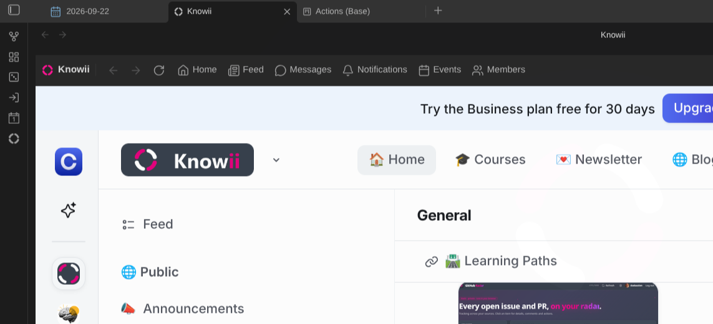
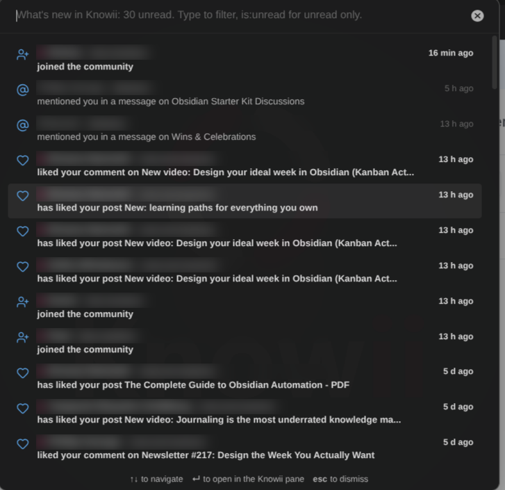
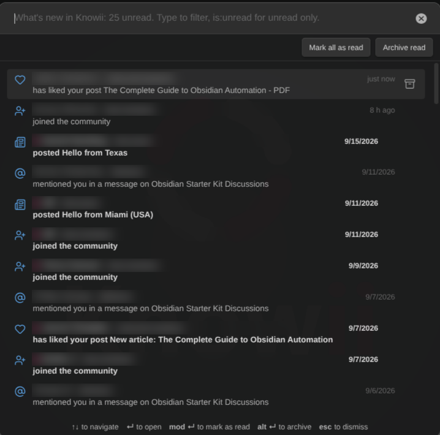
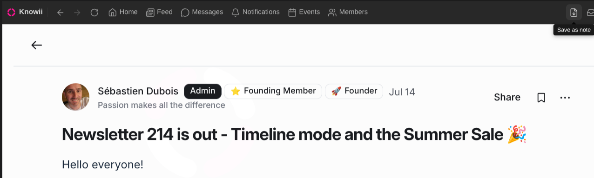
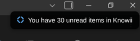

# Knowii Community plugin for Obsidian

Take part in the [Knowii community](https://www.store.dsebastien.net/product/knowii-community/) without leaving your vault. The plugin opens the community in a pane inside Obsidian: read the feed, follow discussions in the spaces, ask questions, answer others, check notifications, send direct messages and join events, right next to your notes.

Knowii is a community of practice for knowledge workers who want to organize their notes, find what they need and put their knowledge to work. This plugin ships with the [Obsidian Starter Kit](https://store.dsebastien.net) and works in any vault.

## What you get

- **The community in a pane**: the whole of Knowii, hosted inside Obsidian. Open it as a main tab or dock it in a sidebar.
- **You stay signed in**: sign in once, the pane remembers you across restarts.
- **Shortcuts**: a toolbar with back, forward, reload, and one-click access to the home page, the feed, messages, notifications, events and members.
- **Commands**: open Knowii, jump straight to the feed or your messages, reload the pane, or open the current page in your browser. Bind them to hotkeys if you like.
- **Picks up where you left off**: the pane reopens the page you were on.
- **Zoom**: shrink or enlarge the community to fit a narrow sidebar.
- **Notifications in Obsidian**: new direct messages, chat messages, thread replies, mentions, comments, posts, reactions, events and new members pop up as notices and as system notifications (always, only in the background, or never: your choice). Click one to open it in the pane. Every kind can be switched off.
- **Unread counts**: unread notifications and messages in the status bar, the total as a badge on the ribbon icon.
- **What's new list**: recent activity, newest first, unread in bold (Gmail style), searchable (`is:unread` for unread only). Open it from the command palette, the status bar, the pane's toolbar or any "unread" notice. Enter opens the item.
- **The whole community, not only your notifications**: new posts, comments and chat messages in every space you belong to (switch any space off). Your own are left out.
- **Mark as read, archive**: per item, or all at once. Notifications, conversations and threads are marked read (and notifications archived) on Knowii itself, so the web app agrees.
- **Save to your vault**: any post (with its comments) or chat message (with its thread) becomes a note in one click.
- **Ask the community** from a selection or a whole note: pick a space, post, done.
- **Reply to direct messages** from the notice or the list, without opening Knowii.
- **Events**: the upcoming ones in a list, and a reminder 15 minutes before those you attend.
- **Instant**: on desktop, new messages and notifications arrive within seconds through Knowii's own live connection.
- **Ribbon right-click**: the latest unread items straight in a menu, plus "Show what's new" and "Check now".
- **Admin shortcuts**: community admins get an Admin menu in the pane (Dashboard, Audience), the same entries in the ribbon menu, and matching commands.

## Screenshots

## Getting started

1. Install the plugin from the community plugin directory ([Knowii Community](https://community.obsidian.md/plugins/knowii-community)) and enable it. It also ships with the Obsidian Starter Kit.
2. Click the Knowii icon in the ribbon, or run the **Open Knowii** command.
3. Sign in with your Knowii account. Not a member yet? The welcome card points you to everything Knowii offers.

## Settings

| Setting              | Default                  | What it does                                                                                   |
| -------------------- | ------------------------ | ---------------------------------------------------------------------------------------------- |
| Open the pane in     | A main tab               | Where "Open Knowii" shows the community: a main tab or a sidebar.                              |
| Show the toolbar     | On                       | Navigation buttons, shortcuts and "Open in browser" above the pane.                            |
| Reopen the last page | On                       | Come back to the page you were on instead of the community home.                               |
| Zoom                 | 100%                     | Size of the community inside the pane (50% to 200%).                                           |
| Ribbon icon          | On                       | Show the Knowii icon in the ribbon.                                                            |
| Notifications        | All on, every minute     | Background checks, notices, system notifications, badges, and one switch per kind of activity. |
| Community address    | `https://www.knowii.net` | Only change this if the community moves.                                                       |

## Good to know

- The pane needs the desktop app. On mobile, the plugin offers to open Knowii in your browser instead.
- Signing out happens inside Knowii, like in a browser: open your profile menu and sign out.
- The community keeps its own session, separate from your browser's.
- **Your Knowii session is stored in the plugin settings** (`.obsidian/plugins/knowii-community/data.json`). That is what lets the plugin check for new activity in the background and on your other devices (mobile included) once you signed in on a desktop. Anyone who gets a copy of that file can use your Knowii account: do not share your `.obsidian` folder. Sign out of Knowii, or use **Forget** under Settings → Advanced → Stored session, to remove it.
- Notifications read the same pages the Knowii web app reads, as you. Nothing is marked as read until you open it.

## Documentation

- [User guide](https://knowii-oss.github.io/obsidian-knowii-community/)
- [Changelog](./CHANGELOG.md)

## Development

See [DEVELOPMENT.md](./DEVELOPMENT.md) and [CONTRIBUTING.md](./CONTRIBUTING.md).

## License

MIT License - see [LICENSE](./LICENSE) for details.

<!-- support-cta -->

## News & support

To stay up to date about this plugin, Obsidian in general, Personal Knowledge Management and note-taking:

- Subscribe to [my newsletter](https://dsebastien.net/newsletter)
- Subscribe to [my YouTube channel](https://youtube.com/@dsebastien)
- Join the [Knowii community](https://www.store.dsebastien.net/product/knowii-community/) and learn to organize your notes and put your knowledge to work, together with fellow knowledge workers

If this plugin is useful to you, here are the best ways to support my work ❤️:

- [Join the Knowii community](https://www.store.dsebastien.net/product/knowii-community/)
- [Become a GitHub Sponsor](https://github.com/sponsors/dsebastien)
- [Buy me a coffee](https://www.buymeacoffee.com/dsebastien)
- [Subscribe to my YouTube channel](https://youtube.com/@dsebastien)
- [Check out my products](https://store.dsebastien.net)
