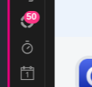
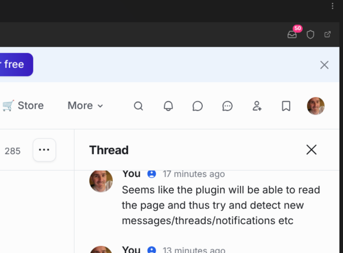

# Usage

## Getting started

Click the Knowii icon in the ribbon or run the **Open Knowii** command. The first time, a welcome card lets you sign in, or discover Knowii if you are not a member yet. After that, the pane opens straight on the community.

Sign in once: the pane keeps its own session, separate from your browser, and remembers you across restarts. On your other computers the pane opens already signed in: your session travels with the plugin settings (see [Your session](#your-session)). To sign out, use your profile menu inside Knowii, as you would in a browser.

## The toolbar

Above the community, the toolbar offers back, forward and reload, shortcuts to the home page, the feed, your messages, notifications, events and members, an inbox button with your unread count (opens the "what's new" list), an **Admin** menu for community admins, and a button to open the current page in your browser. In a narrow sidebar the shortcuts show icons only; hover them for their names.

## Notifications

Once you are signed in, the plugin tells you about new activity as it happens. On desktop it keeps the same live connection Knowii's web app uses, so a new message or notification shows up within seconds; it also checks in the background (every minute by default) as a safety net, and on mobile that background check is what keeps you informed:

 

- **Notices** in Obsidian for each new item: who, what, and a short quote. Click a notice to open the item in the pane. More than three new items at once are folded into one summary notice.
- **System notifications** for the same items (by default always; choose "only when Obsidian is in the background" or "never" in the settings). Click one to bring Obsidian back on that item.
- **Status bar**: unread notifications (bell) and unread conversations and threads (speech bubble). Click it to see what's new.
- **Ribbon badge**: the total unread count on the Knowii icon.

The first check on a device does not replay your whole backlog: it shows one "You have N unread items" notice instead.

What you are told about:

| Kind                 | When                                                                                |
| -------------------- | ----------------------------------------------------------------------------------- |
| Direct messages      | A member sends you a direct message                                                 |
| Chat messages        | New messages in a space chat or a group conversation you are part of                |
| Thread replies       | New replies in a chat thread you follow                                             |
| Mentions             | Someone mentions you in a post, a comment or a message                              |
| Comments and replies | Comments on your posts, replies in discussions you follow                           |
| New posts            | New posts in the spaces you follow (as set in your Knowii notification preferences) |
| Likes and reactions  | Someone likes or reacts to your post or comment                                     |
| Events               | Event invitations, reminders and updates                                            |
| New members          | Someone joins the community (hosts and moderators)                                  |
| Everything else      | Any other community notification                                                    |

Each kind has its own switch in the settings. The plugin also checks right away when you come back to Obsidian and a few seconds after you browse the pane, so reading something there clears it from the counts quickly.

## Watch the whole community

By default the plugin does not stop at what Knowii notifies you about. It also watches every space for:

- new posts (posts, events), and new comments on them,
- new messages in every chat space, thread replies included.

Only the spaces you belong to are watched (spaces you can see but have not joined are left alone, and private spaces you cannot open are never listed). Your own posts, comments and messages are left out, and nothing from before you turned the watch on is replayed. Every space has its own switch under **Settings → Watch the whole community** (the list appears after the first check). Chat spaces with unread messages are read on every check; the others take turns, so each is looked at every few minutes.

These items use the same kinds as the rest (new posts, comments and replies, chat messages, thread replies), so the **Notify me about** switches apply to them too.

## Read and archive

Things don't have to pile up:

- **Open** an item (Enter or click): it is marked as read.
- **Move** with the arrows, or Ctrl+J / Ctrl+K without leaving the keyboard's home row.
- **Mark as read**: the ✓ button on a row, or Ctrl/Cmd+Enter.
- **Archive**: the archive button on a row, Ctrl+E or Alt+Enter. The item leaves the list; it only comes back if something new happens on it (a new message in that conversation, a new update on that notification).
- **Mark all as read** and **Archive read**, at the top of the list, in the ribbon's right-click menu, and as commands. Marking everything as read asks first.

Notifications, conversations and threads are marked as read on Knowii itself, and archiving a notification archives it on Knowii too, so the web app and the plugin agree. Posts, comments and chat messages found by watching the whole community have no read state on Knowii; the plugin keeps theirs on this device (reading a chat message also marks its chat as read on Knowii).

## What's new

The "what's new" list shows your recent community activity, newest first: conversations, threads and notifications. What you have not read yet is in bold with a pink dot, like unread mail; what you have read stays in the list, quieter. Type to filter; type `is:unread` to keep unread items only. Enter opens the item in the pane.

Open it from:

- the **Show what's new in Knowii** command,
- the status bar item,
- the inbox button in the pane's toolbar (it carries the unread count),
- any notice or system notification about unread items ("You have N unread items", "N more new").

**Right-click the Knowii ribbon icon** for a quicker look: the latest unread items straight in the menu (click one to open it), then "Show what's new" and "Check now".

## Save posts and threads as notes

Keep what matters out of the stream and in your vault:

- in the "what's new" list, the **Save as note** button on a post, a comment or a chat message (or Ctrl/Cmd+S),
- in the pane, the **Save as note** button of the toolbar while you read a post or a chat message,
- the command **Save the current Knowii page as a note**.

A post is saved with its comments, a chat message with its whole thread. The note goes to the folder set in the settings (**Knowii** by default), with the author, the space, the dates and a link back to Knowii in its properties, and opens right away. Saving the same post again opens the existing note instead of overwriting it, so your own additions are safe.

## Ask the community

Stuck on something in your vault? Select the text you want to discuss, right-click, and choose **Ask the Knowii community** (or run **Ask the community** from the command palette, or right-click a note in the file explorer). A window opens with your selection (or the whole note) as the question and the note's name as the title; pick the space (**Ask the Community** first), adjust, and post. The post is published right away, as you, and opens in the pane.

## Reply without opening Knowii

Answer a direct message where you see it:

- the **Reply** button on a direct-message notice,
- the **Reply** button on a direct message in the "what's new" list (or Ctrl/Cmd+R).

Type, then **Send** (or Ctrl/Cmd+Enter). The conversation is marked as read.

## Events

**Show upcoming Knowii events** (also in the ribbon's right-click menu) lists the events ahead, soonest first; the ones you said you would attend are highlighted. Enter opens one in the pane. For those you attend, the plugin reminds you 15 minutes before they start, with a notice and a system notification (switch it off with **Events** under **Notify me about**).

## Admin shortcuts

When you are an admin of the community, the plugin notices it after its first check and adds:

- an **Admin** button (shield) in the pane's toolbar with **Dashboard** and **Audience**,
- the same two entries at the bottom of the ribbon's right-click menu,
- the commands **Open Knowii admin: dashboard** and **Open Knowii admin: audience**.

Members who are not admins never see any of it.

## Your session

The plugin stores your Knowii session (the sign-in cookies of the pane) in its settings file, `.obsidian/plugins/knowii-community/data.json`. This is what makes the notifications work:

- on a desktop, checks use the pane's own session; the stored copy is kept in step with it;
- on your other devices, including mobile, the stored copy arrives with your vault and the plugin checks with it, so you get notified there without signing in again;
- on a desktop where the pane has no session yet, the stored one signs the pane in.

Treat that file like a password: anyone with a copy can use your Knowii account. Do not share your `.obsidian` folder or publish it. Signing out of Knowii (profile menu, in the pane) ends the session everywhere and the plugin forgets it; **Forget** under Settings → Advanced → Stored session removes the stored copy without signing you out of the pane.

## Commands

| Command                                | What it does                                                                     |
| -------------------------------------- | -------------------------------------------------------------------------------- |
| Open Knowii                            | Opens or reveals the pane                                                        |
| Open Knowii: home                      | Opens the pane on the community home page                                        |
| Open Knowii: feed                      | Opens the pane on the feed                                                       |
| Open Knowii: messages                  | Opens the pane on your direct messages                                           |
| Open Knowii: notifications             | Opens the pane on your notifications                                             |
| Open Knowii: events                    | Opens the pane on the events                                                     |
| Open Knowii: members                   | Opens the pane on the member directory                                           |
| Show what's new in Knowii              | Lists everything unread; Enter opens an item in the pane                         |
| Check Knowii for new activity now      | Checks right away and shows the unread counts                                    |
| Save the current Knowii page as a note | Saves the post (with comments) or chat message (with its thread) you are reading |
| Ask the community                      | Posts your selection or note as a question in a space you pick                   |
| Show upcoming Knowii events            | Lists the events ahead; Enter opens one                                          |
| Mark everything in Knowii as read      | Notifications, conversations and threads, on Knowii too (asks first)             |
| Archive what is read in Knowii         | Clears everything read from the list                                             |
| Open Knowii admin: dashboard           | Community dashboard (admins only)                                                |
| Open Knowii admin: audience            | Member management (admins only)                                                  |
| Reload the Knowii pane                 | Reloads the community (only when the pane is open)                               |
| Open Knowii in your browser            | Opens the current page, or the community home, in your browser                   |

## If you don't see system notifications

The plugin hands notifications to your operating system; the system decides whether to show them. When notices appear in Obsidian but nothing pops up on your desktop:

- **Check the plugin setting**: Settings → Knowii Community → System notifications should be **Always** (or **Only when Obsidian is in the background**, then switch to another app to see them).
- **Windows**: Settings → System → Notifications: notifications must be on, and on for Obsidian. **Do not disturb** (Focus assist on older versions) holds them back.
- **macOS**: System Settings → Notifications → Obsidian: allow notifications (macOS may ask the first time). A **Focus** mode (Do Not Disturb, Sleep, Work…) holds them back.
- **Linux**: your desktop's notification service must be running, and not in do-not-disturb mode (on Omarchy: the indicator in the top bar, or `omarchy-toggle-notification-silencing`).

Run **Check Knowii for new activity now** after changing something: if there is anything unread, a notification follows.

## Mobile

The pane needs the desktop app. On mobile, the plugin offers to open Knowii in your browser. Notifications and the "what's new" list work on mobile too, with the session stored from a desktop sign-in; items open in your browser there.
